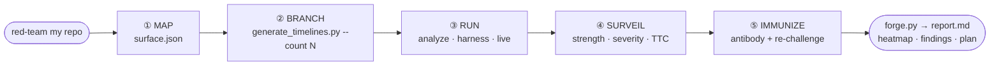

# Nexus Forge

**Adversarial, multi-timeline security testing for systems you own.**

A [Claude Code](https://claude.com/claude-code) skill that threat-models your own app the way the
TVA sees time in *Loki*: a single request branches into many **timelines**, one per
`(attacker × vector × response)` combination. Each branch is reasoned through (or run) in a sandbox;
the ones where an attack succeeds are **nexus events**. You get a map of where your code holds, where
it breaks, roughly how long each break would take a real attacker, and a proposed **antibody** (fix)
for every weak spot — re-challenged with mutations to prove it actually closes the hole.

> **Strictly defensive.** Nexus Forge only ever points inward, at a target you own or are explicitly
> authorized to test. It produces findings and fixes for the owner — never weaponized exploit kits,
> never hack-back. Read [SECURITY.md](SECURITY.md) before using it.

---

## Why this exists

Static security checklists miss the timeline nobody wrote down — the one living in a *combination*:
this attacker, crossed with that vector, crossed with a payload mutation, crossed with the response
your code happens to take. Modern attackers make this worse: an **adaptive AI adversary** reads your
error messages and routes around controls — it paginates *under* a rate limit, spins up a VM to dodge
device binding, sends a captcha to a solver. A control a polite human respects, an agent probes and
bypasses.

Nexus Forge treats that vastness as the point, not a problem to prune. It **generates scenarios from
your own code**, ranks them, and runs as many as your budget allows — so the obvious high-severity
attacks get covered first, and as you raise the budget the novel mutation/chain timelines fill in.

## What you get

- **A surface map** — entry points, trust boundaries, and the assets an attacker would want.
- **A timeline heatmap** — every `(attacker × vector → asset)` against every response posture, each
  cell marked 🟢 held / 🔴 broke / 🟡 unknown.
- **Nexus findings** — per break: what broke (named function/endpoint/config), severity, and an
  order-of-magnitude **time-to-compromise** estimate with its assumptions stated.
- **Antibodies** — a targeted fix per finding, re-challenged with mutations and labeled
  *neutralized / partial / displaced*, delivered as a **proposal** for you to review.
- **A hardening timeline** — fixes ordered by severity-per-effort into Now / Next / Later.

## Visualized workflow

A single request fans out into many timelines and collapses back into one actionable report. Full
set of diagrams — the nexus matrix, the adaptive mutation loop, the antibody loop, and the
script data flow — in **[docs/WORKFLOW.md](docs/WORKFLOW.md)** (renders on GitHub).



## Efficiency — and why it works on any repo

The skill operates on a **surface map** (an abstraction of endpoints, trust boundaries, and assets),
not on language-specific parsing — so the same tool serves a Kotlin, Python, Go, Node, or Rust repo.
The helper scripts are **Python 3.8+ standard library only**: zero dependencies, no network,
deterministic.

Measured by [`tools/benchmark.py`](tools/benchmark.py) (reproducible — run it yourself):

- A **100-endpoint** surface enumerates and ranks **21,000 attack timelines in ~34 ms**; enumeration
  is never the bottleneck.
- Ranking is by severity, so the default budget `N = 6` spends itself entirely on the **six
  most-severe direct attacks** — effort always buys the most dangerous timeline next, and raising
  `N` adds mutations then chains in strict priority order.
- Beyond-budget scenarios persist in `overflow`, so raising `N` later **resumes** instead of
  restarting.

Full tables, the exact scaling formula, and the honesty caveat (no fabricated detection-rate claims)
in **[docs/EFFICIENCY.md](docs/EFFICIENCY.md)**.

## Repository layout

```
nexus-forge/                     # the repo
├── README.md                    # you are here
├── LICENSE                      # MIT
├── SECURITY.md                  # responsible-use policy + the "Sacred Timeline" rules
├── CONTRIBUTING.md
├── docs/
│   ├── ARCHITECTURE.md          # mental model, the 5 phases, data flow, why skill vs. scripts
│   ├── WORKFLOW.md              # Mermaid diagrams of the whole engagement (renders on GitHub)
│   └── EFFICIENCY.md            # measured scaling + budget/coverage model (reproducible)
├── examples/
│   ├── surface.example.json     # sample Phase-1 surface map (input to generate_timelines.py)
│   └── verdicts.example.json    # sample Phase-3–5 verdicts (input to forge.py)
├── tools/
│   └── benchmark.py             # reproduces the numbers in docs/EFFICIENCY.md
├── tests/
│   ├── test_smoke.py            # stdlib-only smoke tests for both scripts
│   └── test_benchmark.py        # guards the benchmark + the scaling formula
└── nexus-forge/                 # ◀── the installable skill (drop this dir into .claude/skills/)
    ├── SKILL.md                 # the skill definition Claude reads
    ├── references/
    │   ├── threat-actors.md     # the attacker catalog (incl. the adaptive-AI adversary)
    │   ├── response-branches.md # the six response postures + the legal/safe boundary
    │   ├── scoring.md           # strength / severity / time-to-compromise rubric
    │   ├── harness-guide.md     # what to generate per vector in `harness` mode
    │   └── report-template.md   # the exact output structure forge.py fills
    └── scripts/
        ├── generate_timelines.py # surface map + budget N -> ranked timeline list
        └── forge.py              # recorded verdicts -> heatmap + report
```

The inner `nexus-forge/` directory is the self-contained skill. The repo wraps it with docs,
examples, and tests.

## Install the skill

Nexus Forge is a Claude Code skill. Drop the inner `nexus-forge/` directory into a skills location
Claude Code scans:

```bash
git clone https://github.com/GokulMV/nexus-forge.git

# Project-scoped (this repo only):
mkdir -p your-project/.claude/skills
cp -r nexus-forge/nexus-forge your-project/.claude/skills/nexus-forge

# or user-scoped (all your projects):
mkdir -p ~/.claude/skills
cp -r nexus-forge/nexus-forge ~/.claude/skills/nexus-forge
```

Then, in Claude Code, just describe what you want in natural language — the skill triggers on intent:

- "Red-team my API and tell me which parts of the code are weak."
- "Threat-model this repo — spin up 12 timelines."
- "How long would it take an attacker to get the user table out of this service?"
- "Harden this against an AI that paginates under my rate limit."

Or invoke it directly with `/nexus-forge`.

### Requirements
- Claude Code (to run the skill).
- Python **3.8+** for the two helper scripts — **standard library only**, no `pip install`, no
  network access.

## Use the scripts directly

The scripts are useful on their own, and the skill drives them for you. From the repo root:

```bash
# Phase 2 — expand a surface map into a ranked timeline list (base budget is 6)
python3 nexus-forge/scripts/generate_timelines.py examples/surface.example.json --count 6
python3 nexus-forge/scripts/generate_timelines.py examples/surface.example.json --count exhaustive -o timelines.json

# Phases 3–5 — render the final report from recorded verdicts
python3 nexus-forge/scripts/forge.py examples/verdicts.example.json -o report.md

# See the exact input shape for either script
python3 nexus-forge/scripts/generate_timelines.py --schema
python3 nexus-forge/scripts/forge.py --schema
```

`generate_timelines.py` enumerates and ranks the scenario space deterministically but **never decides
a verdict** — Claude does that by reasoning through each timeline against the real code.
`forge.py` just formats the judgments Claude records. See
[docs/ARCHITECTURE.md](docs/ARCHITECTURE.md) for the full data flow.

## How it works (the five phases)

| Phase | Name | What happens |
|-------|------|--------------|
| 1 | **Map** | Inventory entry points, trust boundaries, and assets → `surface.json`. |
| 2 | **Branch** | Cross attacker × vector × response into a ranked matrix, sized to a budget **N** (base 6, expandable to `exhaustive`). |
| 3 | **Run** | Execute each timeline at the chosen depth: `analyze` (reason only), `harness` (generate tests you run), or `live` (run against authorized non-prod). |
| 4 | **Surveil** | Score every nexus point: strength (🟢/🔴/🟡), severity, time-to-compromise. |
| 5 | **Immunize** | Propose an antibody per break and re-challenge it with mutations to confirm it holds. |

The **adaptive loop** is what makes this more than a checklist: a blocked timeline isn't the end —
it mutates (re-encode, chain a second vector, split under a limit, swap transport), and each mutation
is a new timeline. That's how the unanticipated path surfaces.

## The timeline budget (N)

`N` is the main dial. The default base is **6** — a fast first read. Raise it (`12`, `25`,
`exhaustive`, any number) and the generator goes deeper: more attacker×vector pairs, more mutations
per vector, longer chains. Nothing caps it but your time and compute. Scenarios generated beyond `N`
are held in `overflow`, so expanding the budget later resumes rather than restarts.

## Run modes at a glance

| Mode | Executes anything? | Where | Use it to |
|------|--------------------|-------|-----------|
| `analyze` | No | Anywhere (even a description) | Find candidate weaknesses on paper. |
| `harness` | You do, not Claude | Your own non-prod | Get parameterized test artifacts to confirm findings. |
| `live` | Yes, Claude runs checks | **Authorized non-prod only** | Prove severity against a disposable/staging target. |

Modes compose — a typical engagement is `analyze` to find candidates, then `harness`/`live` to
confirm the interesting ones.

## Safety & scope

This is defensive tooling. Before any run, these must hold (the skill re-checks them and will stop
to ask if any is uncertain):

1. **Ownership** — the target is yours, or you have explicit, current authorization to test it.
2. **Isolation** — `live` runs go against non-production only; never fuzz or flood a system real
   users depend on.
3. **Findings, not weapons** — output is oriented to *fixing*. No drop-in weaponized exploit kits,
   no hack-back/retaliation (illegal under e.g. the US CFAA and India's IT Act, and it endangers
   *you*).
4. **The adaptive-AI adversary is modeled to defend against it** — describing how an agent bypasses a
   control is in scope as a threat to harden against; turning that into a ready-to-run bypass for an
   arbitrary service is not.

Full policy in [SECURITY.md](SECURITY.md).

## Development

```bash
python3 -m unittest discover -s tests -v    # run the smoke tests (stdlib only)
```

Contributions welcome — see [CONTRIBUTING.md](CONTRIBUTING.md). Please keep the scripts
dependency-free and keep every addition on the defensive side of the line in `SECURITY.md`.

## License

[MIT](LICENSE).
