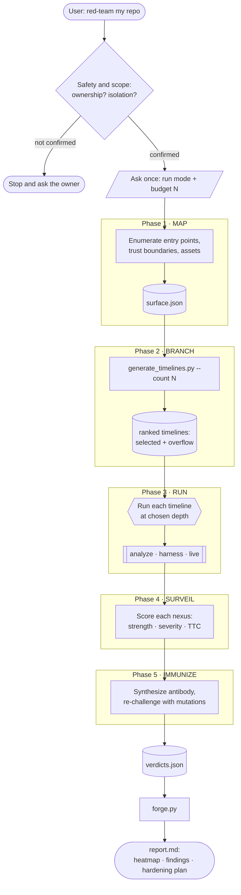
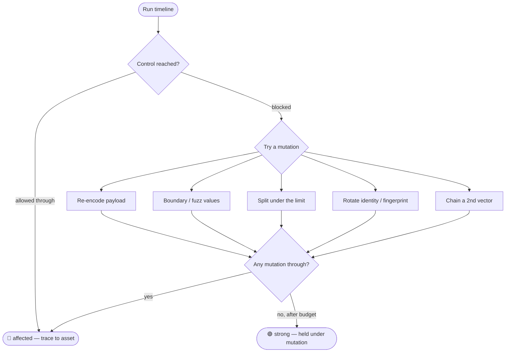
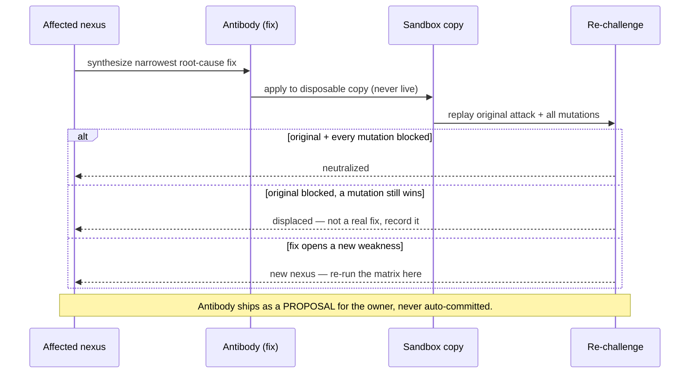
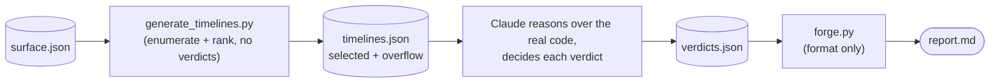

# Visualized Workflow

All diagrams below are [Mermaid](https://mermaid.js.org/) and render automatically on the GitHub
file view — no tooling needed. They show how a single request to Nexus Forge fans out into many
timelines and collapses back into one actionable report.

## 1. The engagement, end to end

## 2. Why it's called a *nexus*: one request, many timelines

Each timeline is one cell of a three-axis matrix. The generator crosses the axes, so the
combinations a checklist never lists — mutations and two-step chains — appear on their own.

```mermaid
flowchart LR
    REQ(["One attack surface"]) --> A

    subgraph A ["Axis A · Attacker"]
        A1["Script opportunist"]
        A2["Known-CVE exploiter"]
        A3["Malicious insider"]
        A4["Adaptive AI adversary"]
        A5["Supply-chain attacker"]
    end

    subgraph B ["Axis B · Vector"]
        B1["Injection"]
        B2["Broken auth"]
        B3["IDOR / privilege"]
        B4["Rate-limit evasion"]
        B5["Deserialization / SSRF"]
        B6["Race / TOCTOU"]
        B7["Prompt injection / tool abuse"]
    end

    subgraph C ["Axis C · Response"]
        C1["Block"]
        C2["Allow (baseline)"]
        C3["Tarpit"]
        C4["Detect and await approval"]
        C5["Deceive (honeypot)"]
        C6["Immune / antibody"]
    end

    A --> B --> C --> NX{{"Nexus point:<br/>did the attack reach the asset?"}}
    NX -- "held" --> GREEN(["🟢 strong"])
    NX -- "broke" --> RED(["🔴 affected"])
    NX -- "undetermined" --> AMBER(["🟡 unknown"])
```

## 3. The adaptive loop — a blocked timeline is not the end

This is what separates Nexus Forge from a static checklist: when a control blocks the literal
payload, the attacker (and so the skill) *mutates*, and each mutation is a new timeline.

## 4. The antibody loop (Phase 5) — fix, then prove the fix holds

## 5. Data flow between the two scripts

The scripts are deterministic scaffolding; the security judgment happens in the reasoning between
them (that's the skill's job — see [ARCHITECTURE.md](ARCHITECTURE.md)).

See [EFFICIENCY.md](EFFICIENCY.md) for how the generator scales and how the budget `N` trades
coverage against effort — with reproducible, measured numbers.
